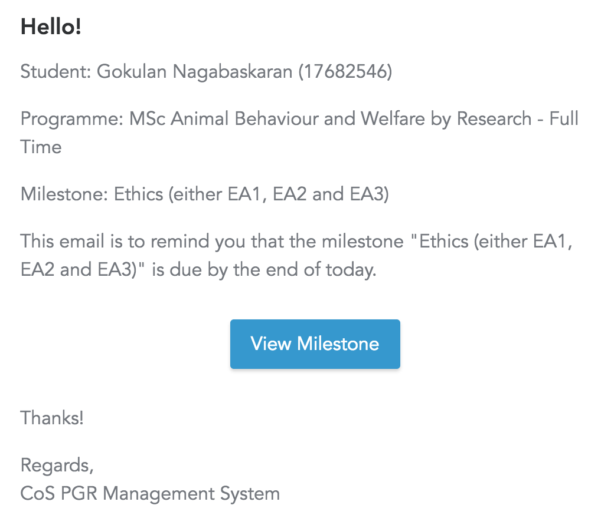
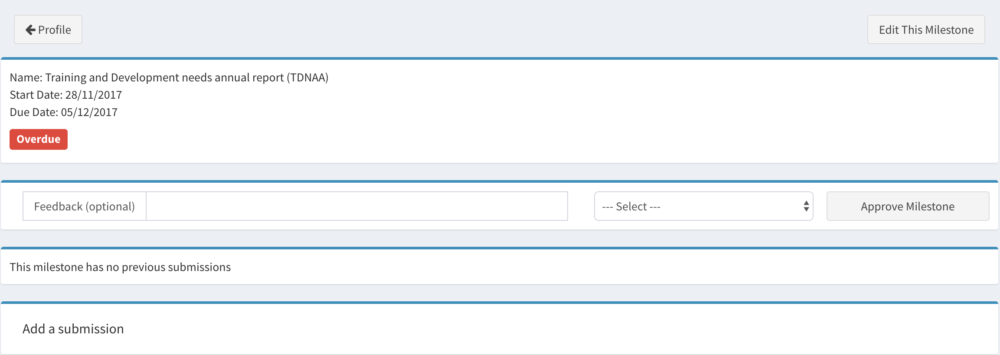

# A short Guide for Students

You are the most important users of this system. It will 

* display your [PGR journey](template) one a timeline and show all the due dates for submission of the important documents, according to the PGR regulation of your institution:
	
* notify you by email about upcoming and due milestones:
	 
* allow you to upload your filled documents online:
	 
* allow you to follow the progress of your submitted milestone documents. You will see in your timeline which steps have been approved and which ones still need some amendments. You will also notified by email by the system automatically, when your submission changes status.
	 
* allow you to submit other documents (e.g. when you request to change supervisor) which are not in your timeline and inform the administrators and you supervisors automatically.

## Login

* Simply go to the application's URL (e.g. https://lcas.lincoln.ac.uk/pgr) and enter your usual university credentials
* You may find your record still empty if your enrolment has not yet been processed by the admins

## Your Dashboard

After logging in the dashboard directly shows all upcoming, recently submitted, and overdue milestones Also, you can check all the data the system holds in your record. Clicking on "View All Milestones" takes you to your [timeline](images/timeline.png):

